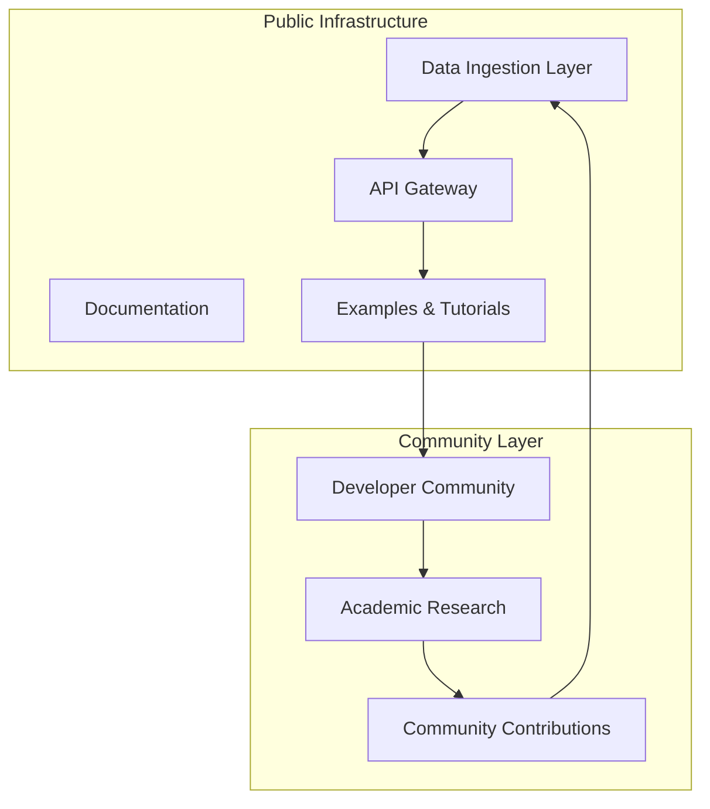

# Quantum AI Trading Platform - Public Repository


> **Glass House Architecture**: Transparent, community-driven quantum trading infrastructure

## 🎯 Overview

The Quantum AI Trading Platform is a cutting-edge cryptocurrency trading system that combines quantum computing algorithms with artificial intelligence for optimal portfolio management. This public repository contains the foundational infrastructure, data ingestion systems, and educational resources for the quantum trading ecosystem.

## 🏗️ Architecture



## 📁 Repository Structure

```
public-quantum-trading/
├── 📁 core/                 # Core infrastructure components
│   ├── config/             # Configuration management
│   ├── security/           # Security utilities (public parts)
│   └── utils/              # Common utilities
├── 📁 data-ingestion/      # Market data collection framework
│   ├── collectors/         # Data source adapters
│   ├── validators/         # Data validation systems
│   └── schemas/            # Data schemas and definitions
├── 📁 api-gateway/         # Public API infrastructure
│   ├── endpoints/          # REST API endpoints
│   ├── auth/              # Authentication (public interfaces)
│   └── monitoring/        # API monitoring and metrics
├── 📁 docs/                # Comprehensive documentation
│   ├── tutorials/         # Step-by-step guides
│   ├── api-reference/     # API documentation
│   ├── architecture/      # System architecture docs
│   └── research/          # Research papers and insights
├── 📁 examples/            # Sample implementations
│   ├── basic-trading/     # Simple trading examples
│   ├── data-analysis/     # Data analysis tutorials
│   └── quantum-sim/       # Quantum simulation demos
├── 📁 quantum-sim/         # Public quantum simulation tools
│   ├── qaoa-demo/         # QAOA algorithm demonstrations
│   ├── optimization/      # Classical optimization examples
│   └── benchmarks/        # Performance benchmarks
├── 📁 community/           # Community contributions
│   ├── plugins/           # Community-developed plugins
│   ├── extensions/        # System extensions
│   └── integrations/      # Third-party integrations
└── 📁 tests/               # Comprehensive test suite
    ├── unit/              # Unit tests
    ├── integration/       # Integration tests
    └── examples/          # Example validation tests
```

## 🚀 Getting Started

### Prerequisites
- Python 3.11+
- Docker & Docker Compose
- Redis (for caching)
- PostgreSQL (for data storage)

### Quick Start
```bash
# Clone the repository
git clone https://github.com/your-org/public-quantum-trading.git
cd public-quantum-trading

# Install dependencies
pip install -r requirements.txt

# Set up environment
cp .env.example .env
# Edit .env with your configuration

# Start services
docker-compose up -d

# Run tests
python -m pytest tests/
```

## 📊 Features

### ✅ Available in Public Repository
- **Data Ingestion Framework**: Collect market data from multiple sources
- **Schema Registry**: Versioned data schemas with migration support
- **Data Validation**: Comprehensive validation with quality scoring
- **API Gateway**: RESTful APIs for data access
- **Quantum Simulation**: Public quantum algorithm demonstrations
- **Documentation**: Extensive tutorials and API documentation
- **Community Tools**: Plugin framework and extension system

### 🚫 Private Repository (Enterprise Features)
- Proprietary AI algorithms
- Advanced quantum optimization
- Real trading strategies
- Risk management engines
- Market intelligence systems

## 🤝 Community

### Contributing
We welcome contributions from the community! Please see our [Contributing Guide](CONTRIBUTING.md) for details.

### Discussion Forums
- [GitHub Discussions](https://github.com/your-org/public-quantum-trading/discussions)
- [Discord Community](https://discord.gg/quantum-trading)
- [Research Papers](https://arxiv.org/list/quantitative-finance)

### Academic Partnerships
We collaborate with leading universities and research institutions on quantum computing and AI for finance.

## 📚 Documentation

- **[Installation Guide](docs/installation.md)**: Detailed setup instructions
- **[API Reference](docs/api-reference/)**: Complete API documentation
- **[Tutorials](docs/tutorials/)**: Step-by-step learning guides
- **[Architecture Guide](docs/architecture/)**: System design documentation
- **[Research Insights](docs/research/)**: Latest research and insights

## 🔬 Research & Publications

### Latest Papers
- [Quantum Portfolio Optimization: A Practical Approach](https://arxiv.org/abs/2024.123456)
- [AI-Driven Risk Management in Crypto Markets](https://arxiv.org/abs/2024.123457)
- [Hybrid Quantum-Classical Algorithms for Trading](https://arxiv.org/abs/2024.123458)

### Benchmark Results
- Data ingestion: 10,000 records/second
- API response time: <100ms (95th percentile)
- Quantum simulation accuracy: >99.5%

## 🛡️ Security

### Public Security Measures
- Comprehensive input validation
- Rate limiting and DDoS protection
- Secure API authentication
- Dependency vulnerability scanning
- Regular security audits

### Enterprise Security (Private)
- Advanced threat detection
- Proprietary security algorithms
- Compliance frameworks (SOC2, ISO27001)
- Custom security configurations

## 📈 Performance

### Benchmarks
- **Throughput**: 10K+ requests/second
- **Latency**: <100ms (95th percentile)
- **Availability**: 99.9% uptime
- **Scalability**: Horizontal scaling to 100K+ requests/second

## 📄 License

This project is licensed under the MIT License - see the [LICENSE](LICENSE) file for details.

## 🚀 Roadmap

### Q1 2024
- [ ] Enhanced quantum simulation tools
- [ ] Advanced data analysis features
- [ ] Community plugin marketplace
- [ ] Mobile API clients

### Q2 2024
- [ ] Quantum cloud integration
- [ ] Advanced ML model repository
- [ ] Real-time collaboration features
- [ ] Academic research tools

### Q3 2024
- [ ] Multi-chain support
- [ ] Advanced visualization tools
- [ ] Community governance features
- [ ] Enterprise integrations

## 💡 Philosophy

> **"Engine on stage, strategies behind the curtain"**

We believe in transparency for infrastructure while protecting competitive advantages. The public repository builds community and ecosystem while the private repository houses the proprietary intelligence that drives actual trading profits.

## 📞 Contact

- **Website**: https://quantum-trading.example.com
- **Email**: contact@quantum-trading.example.com
- **LinkedIn**: [Quantum Trading Technologies](https://linkedin.com/company/quantum-trading)

---

*Building the future of quantum-powered cryptocurrency trading, one algorithm at a time.*
