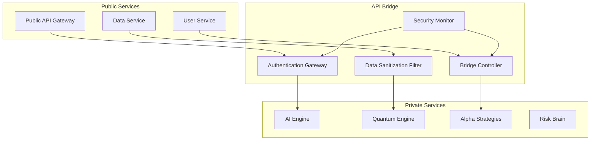

# 🔗 Quantum Trading API Bridge

> **Secure Gateway**: Connecting the Glass House to the Vault

## 🎯 Overview

The API Bridge is the critical component that securely connects the public quantum trading infrastructure with the proprietary trading vault. It ensures that public-facing services can access the intelligence from the private algorithms while maintaining security and competitive advantage.

## 🏗️ Architecture



## 🔐 Security Layers

### 1. Authentication & Authorization
```python
# Multi-layer security validation
class SecureAPIBridge:
    def __init__(self):
        self.auth_service = MFAService()          # Multi-factor auth
        self.rbac_service = RBACService()         # Role-based access
        self.session_manager = SessionManager()   # Secure sessions
        self.audit_logger = AuditLogger()         # Complete audit trail
    
    def validate_request(self, request):
        # Validate identity and permissions
        identity = self.auth_service.validate(request.credentials)
        permissions = self.rbac_service.check_permissions(identity, request.resource)
        
        # Log all access attempts
        self.audit_logger.log_access(identity, request, permissions)
        
        return permissions.granted
```

### 2. Data Sanitization & Filtering
```python
class DataSanitizer:
    def __init__(self):
        self.sensitive_data_filter = SensitiveDataFilter()
        self.anonymizer = DataAnonymizer()
        self.data_classifier = DataClassifier()
    
    def sanitize_input(self, input_data):
        # Classify data sensitivity
        classification = self.data_classifier.classify(input_data)
        
        # Apply appropriate filtering
        if classification.sensitivity_level > SensitivityLevel.PUBLIC:
            return self.sensitive_data_filter.remove(input_data)
        
        # Anonymize for public consumption
        return self.anonymizer.anonymize(input_data)
    
    def sanitize_output(self, private_data, public_request):
        # Strip proprietary algorithms
        # Only return sanitized results
        sanitized = self.extract_signals(private_data)
        return self.anonymizer.anonymize(sanitized)
```

## 🛡️ Security Features

### Multi-Factor Authentication
- Hardware security keys (FIDO2)
- Biometric authentication
- SMS/Email verification
- IP whitelisting

### Role-Based Access Control (RBAC)
```yaml
# Access Control Matrix
roles:
  public_user:
    permissions: [read_public_data, view_examples]
    data_access: sanitized_only
    
  researcher:
    permissions: [read_public_data, access_quantum_sim, submit_research]
    data_access: anonymized_data
    
  enterprise_client:
    permissions: [read_public_data, access_basic_signals, api_access]
    data_access: signal_data_only
    
  authorized_trader:
    permissions: [full_api_access, advanced_signals, risk_data]
    data_access: operational_data
    
  admin_user:
    permissions: [all_permissions]
    data_access: full_access
```

### Data Classification & Filtering
| Data Type | Public Access | Sanitization | Notes |
|-----------|---------------|--------------|--------|
| **Raw Market Data** | ✅ Yes | Price/volume only | No order book details |
| **AI Predictions** | ✅ Yes | Confidence scores only | No model details |
| **Trading Signals** | ⚠️ Limited | Basic signals only | No proprietary algorithms |
| **Risk Metrics** | ❌ No | N/A | Private repository only |
| **Alpha Strategies** | ❌ No | N/A | Private repository only |
| **Proprietary Algorithms** | ❌ No | N/A | Private repository only |

## 🔗 API Endpoints

### Public Endpoints (Available to All)
```python
# Market Data Access
@app.route('/api/v1/market/data')
def get_market_data():
    """Public market data with basic analytics"""
    data = data_service.get_current_prices()
    return sanitize_public_data(data)

# Quantum Simulation Results
@app.route('/api/v1/quantum/simulation')
def quantum_simulation():
    """Public quantum algorithm demonstrations"""
    simulation = quantum_engine.run_public_simulation()
    return sanitize_simulation_results(simulation)

# Educational Content
@app.route('/api/v1/education/tutorials')
def educational_content():
    """Tutorials and learning materials"""
    return public_education_service.get_content()
```

### Protected Endpoints (Authenticated Users Only)
```python
# Basic Trading Signals
@app.route('/api/v1/signals/basic')
@require_authentication(['enterprise_client'])
def get_basic_signals():
    """Sanitized trading signals for enterprise clients"""
    signals = alpha_engine.get_basic_signals()
    return sanitize_signals(signals)

# Risk Assessment (Limited)
@app.route('/api/v1/risk/basic')
@require_authentication(['authorized_trader'])
def get_risk_metrics():
    """Basic risk metrics (no proprietary models)"""
    risk_data = risk_brain.get_public_risk_metrics()
    return sanitize_risk_data(risk_data)
```

### Internal Endpoints (Bridge Only)
```python
# Bridge-to-Vault Communication
@app.route('/bridge/v1/alpha/generate')
@require_bridge_authentication()
def generate_alpha():
    """Internal endpoint for alpha generation"""
    # Only accessible from bridge controller
    return alpha_engine.generate_signals()

@app.route('/bridge/v1/risk/assess')
@require_bridge_authentication()
def assess_risk():
    """Internal endpoint for risk assessment"""
    # Only accessible from bridge controller
    return risk_brain.assess_portfolio()
```

## 📊 Data Flow Architecture

### Public Data Flow
```
Market Data → Public Collector → Sanitizer → Public API
     ↓
Quantum Sim → Algorithm Demo → Results → Public Education
     ↓
Community Code → Review → Sanitize → Public Examples
```

### Private Data Flow
```
Raw Market Data → Private Collector → AI Engine → Alpha Signals
     ↓
Risk Models → Proprietary Calculations → Risk Intelligence
     ↓
Trading Strategies → Execution Engine → Profit Generation
```

### Bridge Data Flow
```
Public Request → Authentication → Sanitization → Private API
     ↓
Private Response → Signal Extraction → Anonymization → Public API
     ↓
Client ← Sanitized Response ← Rate Limiting ← Security Check
```

## 🔒 Security Monitoring

### Real-Time Security Monitoring
```python
class SecurityMonitor:
    def __init__(self):
        self.threat_detector = ThreatDetector()
        self.access_analyzer = AccessAnalyzer()
        self.anomaly_detector = AnomalyDetector()
    
    def monitor_bridge_traffic(self, request_data):
        # Detect suspicious patterns
        threats = self.threat_detector.analyze(request_data)
        
        # Check for access anomalies
        anomalies = self.anomaly_detector.detect(request_data)
        
        # Log security events
        if threats or anomalies:
            self.log_security_event(request_data, threats, anomalies)
        
        return threats == 0 and anomalies == 0
```

### Audit Trail System
```python
class AuditLogger:
    def log_access(self, user, resource, action):
        audit_entry = {
            'timestamp': datetime.utcnow(),
            'user_id': user.id,
            'user_role': user.role,
            'resource': resource,
            'action': action,
            'ip_address': user.ip_address,
            'user_agent': user.user_agent,
            'success': True,
            'risk_score': self.calculate_risk_score(user, resource)
        }
        
        # Store in immutable audit log
        self.audit_store.store(audit_entry)
```

## 🚨 Security Alerts & Response

### Threat Detection Rules
- **Brute Force**: >5 failed authentication attempts
- **Data Exfiltration**: Unusual data volume access
- **Privilege Escalation**: Unauthorized permission elevation
- **Anomalous Behavior**: Non-standard access patterns
- **Time-based Anomalies**: Access outside normal hours

### Automatic Response Actions
1. **Level 1**: Alert security team
2. **Level 2**: Temporary access restriction
3. **Level 3**: Account suspension
4. **Level 4**: System lockdown
5. **Level 5**: Emergency protocol activation

## 🔄 Monitoring & Compliance

### Performance Metrics
- **API Response Time**: Target <100ms (95th percentile)
- **Authentication Success Rate**: Target >99.9%
- **Data Sanitization Accuracy**: Target >99.99%
- **Security Event Response**: Target <1 minute

### Compliance Monitoring
- **Access Logging**: 100% of requests logged
- **Data Classification**: All data properly classified
- **Retention Policies**: Automatic data lifecycle management
- **Regulatory Reporting**: Automated compliance reports

## 📋 Configuration

### Environment Variables
```bash
# Bridge Configuration
BRIDGE_PORT=8443
BRIDGE_SSL_CERT=/path/to/certificate.pem
BRIDGE_SSL_KEY=/path/to/private.key

# Security Configuration
AUTH_SERVICE_URL=https://auth-service.internal
RBAC_SERVICE_URL=https://rbac-service.internal
AUDIT_LOG_ENDPOINT=https://audit-service.internal

# Private Service Endpoints
AI_ENGINE_ENDPOINT=https://ai-engine.private:8080
QUANTUM_ENGINE_ENDPOINT=https://quantum-engine.private:8080
ALPHA_ENGINE_ENDPOINT=https://alpha-engine.private:8080
```

### Bridge Configuration File
```yaml
# bridge-config.yaml
bridge:
  port: 8443
  ssl:
    enabled: true
    cert_file: "/etc/ssl/certs/bridge.crt"
    key_file: "/etc/ssl/private/bridge.key"
  
security:
  mfa_required: true
  session_timeout: 3600
  rate_limit: 1000  # requests per hour
  suspicious_activity_threshold: 5

data_sanitization:
  enabled: true
  anonymization_level: "standard"
  sensitive_data_filter: "strict"

private_services:
  ai_engine:
    endpoint: "https://ai-engine.private:8080"
    timeout: 5s
    retry_count: 3
  
  quantum_engine:
    endpoint: "https://quantum-engine.private:8080"
    timeout: 10s
    retry_count: 2
```

## 🚀 Deployment

### Docker Deployment
```dockerfile
FROM quantum-trading/bridge:latest

EXPOSE 8443

ENV BRIDGE_CONFIG=/app/config/bridge-config.yaml
ENV SSL_CERT=/app/certs/bridge.crt
ENV SSL_KEY=/app/certs/bridge.key

CMD ["python", "-m", "bridge.main", "--config", "$BRIDGE_CONFIG"]
```

### Kubernetes Deployment
```yaml
apiVersion: apps/v1
kind: Deployment
metadata:
  name: quantum-bridge
spec:
  replicas: 3
  selector:
    matchLabels:
      app: quantum-bridge
  template:
    metadata:
      labels:
        app: quantum-bridge
    spec:
      containers:
      - name: bridge
        image: quantum-trading/bridge:latest
        ports:
        - containerPort: 8443
        env:
        - name: BRIDGE_CONFIG
          value: "/app/config/bridge-config.yaml"
        volumeMounts:
        - name: config-volume
          mountPath: "/app/config"
        - name: cert-volume
          mountPath: "/app/certs"
      volumes:
      - name: config-volume
        configMap:
          name: bridge-config
      - name: cert-volume
        secret:
          secretName: bridge-ssl-certs
```

---

*The bridge that connects transparency to proprietary intelligence.*